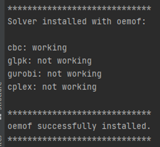

# WEFEConfigurator

WEFEConfigurator is an open software tool designed to set up, simulate and optimize models of integrated water-energy-food-environment systems (iWEFEs). These combine different renewable energy (RE) technologies,
such as photovoltaics, wind turbines, hydropower, and biogas plants, storage systems such as
batteries, hydrogen, or water tanks, and productive uses, such as water pumping, water treatment,
irrigation, cold storage, agricultural processing, via smart control systems. An example of such are agrivoltaics which 
provide sustainable renewable energy production tapping WEFE synergies (e.g. reducing land competition
between energy and food production and reducing evapotranspiration from the field, leading to less
irrigation demand). It utilizes [oemof.solph](https://github.com/oemof/oemof-solph) and 
[oemof.tabular](https://github.com/oemof/oemof-tabular) libraries, along with additional plugins for extended 
functionality. Users can create and run scenarios using different technologies as components with their respective 
demand and generation profiles as [csv](https://en.wikipedia.org/wiki/Comma-separated_values) files. Moreover, the user 
can also define new components/technologies in addition to the existing ones. The results from the modelled scenario can
then be interactively visualized through [dash](https://dash.plotly.com/).

## Prerequisites

Make sure a supported Python Version (3.9 or greater) and an interpreter (preferably PyCharm) is installed on your system. 
Install CBC solver for oemof-solph using the installation instructions: 
https://github.com/oemof/oemof-solph?tab=readme-ov-file#installing-a-solver

## Installation

For using the WEFEConfigurator, clone the repository to your local machine. Then create a new virtual environment with 
a supported Python Version (3.9 or greater). Activate the new virtual environment and move to the repository folder to 
install the oemof-tabular-plugins package.

    pip install oemof_tabular_plugins==0.0.2rc4 numpy==1.26.0 git+https://github.com/oemof/oemof-tabular.git@dev git+https://github.com/sedos-project/oemof.industry.git@saltwater

Verify the installation of CBC solver by typing in the terminal: 

    oemof_installation_test    

If successful, the following message will appear: 

If unsuccessful, the message will say "cbc: not working", in which case an external executable "cbc.exe" file from a 
successful installation should be included in your path and your system restarted.

Once all of these steps have been completed successfully, you are ready to run scenarios!

## Troubleshooting

For Windows users, an error might appear when installing oemof-tabular: 
    
    "ERROR: Could not build wheels for cchardet, which is required to install pyproject.toml-based projects"
Guidelines on how to fix this error: https://github.com/twintproject/twint/issues/1407#issuecomment-1141734344

## Get started

Simply click on the green `Use this template` button on the left of the `Clone or download` button.

The detailed instructions to create a new repository from this template can be found [here](https://help.github.com/en/articles/creating-a-repository-from-a-template).

## src folder

This folder is where you should place the code of your package (package name to be edited in `setup.py` under name)

You can install it locally for developing with

    python setup.py install
    
More details for packaging are available on [https://packaging.python.org](https://packaging.python.org/tutorials/packaging-projects/)

## Docs

To build the docs simply go to the `docs` folder

    cd docs

Install the requirements

    pip install -r docs_requirements.txt

and run

    make html

The output will then be located in `docs/_build/html` and can be opened with your favorite browser

## Code linting

In this template, 3 possible linters are proposed:
- flake8 only sends warnings and error about linting (PEP8)
- pylint sends warnings and error about linting (PEP8) and also allows warning about imports order
- black sends warning but can also fix the files for you

You can perfectly use the 3 of them or subset, at your preference. Don't forget to edit `.travis.yml` if you want to deactivate the automatic testing of some linters!
